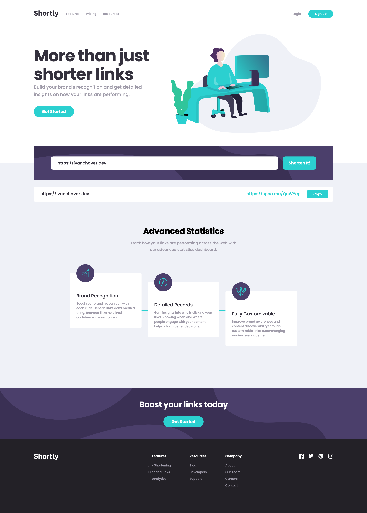

# Frontend Mentor - Shortly URL shortening API Challenge solution

## Welcome! 👋

This is a solution to the [URL shortening API landing page](https://www.frontendmentor.io/challenges/url-shortening-api-landing-page-2ce3ob-G) challenge for [frontendmentor.io](https://www.frontendmentor.io).

## Table of contents

- [Overview](#overview)
  - [The challenge](#the-challenge)
  - [Screenshot](#screenshot)
  - [Links](#links)
- [My process](#my-process)
  - [Built with](#built-with)
  - [What I learned](#what-i-learned)
  - [Continued development](#continued-development)
- [Author](#author)

**Note: Delete this note and update the table of contents based on what sections you keep.**

## Overview

### The challenge

Users should be able to:

- View the optimal layout for the site depending on their device's screen size
- Shorten any valid URL
- See a list of their shortened links, even after refreshing the browser
- Copy the shortened link to their clipboard in a single click
- Receive an error message when the `form` is submitted if:
  - The `input` field is empty

### Screenshot

### Links

- [Solution](https://www.frontendmentor.io/solutions/url-shortener---react-QzeykqRIYF)
- [Live Site](https://frontend-mentor-url-shortener-rosy.vercel.app/)

## My process

### Built with

- [React](https://reactjs.org/) - JS library
- [Tailwind CSS](https://tailwindcss.com/) - Popular Styling Library
- [Zustand](https://github.com/pmndrs/zustand) - Minimalistic State Management Tool
- [spoo.me](https://spoo.me/api) - Free URL Shortening Service

### What I learned

I used this project to play around React and Tailwind and create a very modern landing apge for a URL shortening service. I also took this opportunity to use Zustand for the first time. I really liked it, its very simple and has less boilerplate code compared to Redux.

### Continued development

I might continue working on this project and add my own URL shortening backend api as a fun side project.

## Author

- Website - [Ivan Chavez](https://www.ivanchavez.dev/)
- Frontend Mentor - [@Zaytt](https://www.frontendmentor.io/profile/Zaytt)
